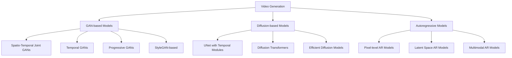
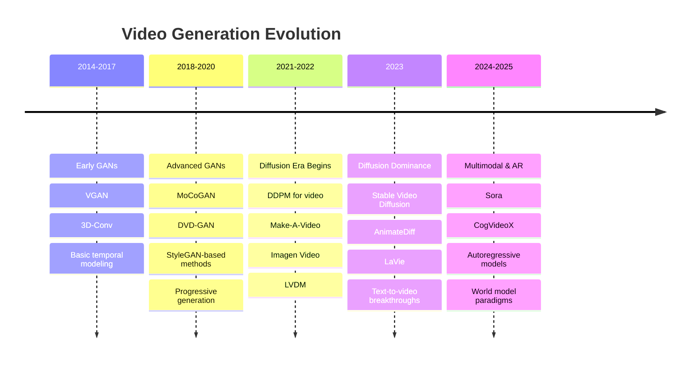

# Video Generation Foundation Model: A Survey

[](https://arxiv.org/)
[](https://github.com/worldbench/survey)

---

## 📖 Overview

The rapid advancement of Artificial Intelligence Generated Content (AIGC) has revolutionized video generation, enabling systems like OpenAI's Sora, Google's Veo3, and Pika Labs' tools to synthesize temporally coherent and semantically rich videos. These advancements pave the way for building "world models" that simulate real-world dynamics, with applications spanning entertainment, education, and virtual reality.

This survey provides a systematic review of the development of video generation technology, tracing its evolution from early GANs to dominant diffusion models, and further to emerging AR-based and multimodal techniques. We conduct an in-depth analysis of the foundational principles, key advancements, and comparative strengths/limitations of each methodology.

### 🎯 Key Contributions

- **Comprehensive Coverage**: Systematic review of three dominant paradigms - GAN-based, Diffusion-based, and Autoregressive (AR)-based methods
- **Historical Perspective**: Traces the evolution from early GANs to current state-of-the-art models
- **Multimodal Integration**: Explores emerging trends in multimodal video generation
- **Future Insights**: Provides guidance for future research in video generation and world modeling

---

## 🏗️ Architecture Overview



---

## 📚 Table of Contents

- [GAN-based Models](#-gan-based-models)
  - [Spatio-Temporal Joint GANs](#spatio-temporal-joint-gans)
  - [Temporal GANs](#temporal-gans)
  - [Progressive GANs](#progressive-gans)
  - [StyleGAN-based Generation](#stylegan-based-generation)
- [Diffusion-based Models](#-diffusion-based-models)
  - [UNet with Temporal Modules](#1-unet-with-temporal-modules)
  - [Diffusion Transformers](#2-diffusion-transformers)
  - [Efficient Video Diffusion Models](#3-efficient-video-diffusion-models)
- [Autoregressive Models](#-autoregressive-models)
  - [Pixel-level AR Models](#pixel-level-ar-models)
  - [Latent Space AR Models](#latent-space-ar-models)
  - [Multimodal AR Models](#multimodal-ar-models)
- [Benchmarks & Evaluation](#-benchmarks--evaluation)
- [Applications & Downstream Tasks](#-applications--downstream-tasks)

---

## 🎭 GAN-based Models

> Generative Adversarial Networks (GANs) laid the groundwork for video synthesis, with innovations in spatio-temporal joint modeling, temporal decomposition, and progressive generation strategies.

### Spatio-Temporal Joint GANs
> Models that process both spatial and temporal dimensions simultaneously using unified architectures.

|     Model     | Paper                                                        |   Venue    |                           Website                            |                            GitHub                            |
| :-----------: | :----------------------------------------------------------- | :--------: | :----------------------------------------------------------: | :----------------------------------------------------------: |
|   `3D-Conv`   | [](https://arxiv.org/)<br>Learning Spatiotemporal Features with 3D Convolutional Networks | Coming Soon |                              -                               |                              -                               |
|     `VGAN`    | [](https://arxiv.org/)<br>Generating Videos with Scene Dynamics | Coming Soon |                              -                               |                              -                               |
|   `DVD-GAN`   | [](https://arxiv.org/)<br>Adversarial Video Generation on Complex Datasets | Coming Soon |                              -                               |                              -                               |

### Temporal GANs
> Models that decompose video generation into motion and content components for more efficient training.

|     Model     | Paper                                                        |   Venue    |                           Website                            |                            GitHub                            |
| :-----------: | :----------------------------------------------------------- | :--------: | :----------------------------------------------------------: | :----------------------------------------------------------: |
|    `MCnet`    | [](https://arxiv.org/)<br>Decomposing Motion and Content for Natural Video Sequence Prediction | Coming Soon |                              -                               |                              -                               |
|   `MoCoGAN`   | [](https://arxiv.org/)<br>MoCoGAN: Decomposing Motion and Content for Video Generation | Coming Soon |                              -                               |                              -                               |
| `MoCoGAN-HD`  | [](https://arxiv.org/)<br>MoCoGAN-HD: A Good Image Generator Is What You Need for High-Resolution Video Synthesis | Coming Soon |                              -                               |                              -                               |
|   `TS-GAN`    | [](https://arxiv.org/)<br>Temporal Shift GAN for Large Scale Video Generation | Coming Soon |                              -                               |                              -                               |

### Progressive GANs
> Models that generate content progressively, starting from low resolution and gradually increasing detail.

|     Model     | Paper                                                        |   Venue    |                           Website                            |                            GitHub                            |
| :-----------: | :----------------------------------------------------------- | :--------: | :----------------------------------------------------------: | :----------------------------------------------------------: |
| `Progressive` | [](https://arxiv.org/)<br>Progressive Growing of GANs for Improved Quality, Stability, and Variation | Coming Soon |                              -                               |                              -                               |
|    `SWGAN`    | [](https://arxiv.org/)<br>Sliced Wasserstein Generative Models | Coming Soon |                              -                               |                              -                               |
| `Patch VAE-GAN` | [](https://arxiv.org/)<br>Patch-based Video Autoencoder with Adversarial Training | Coming Soon |                              -                               |                              -                               |

### StyleGAN-based Generation
> Models leveraging StyleGAN's progressive architecture and style control for high-quality video generation.

|     Model     | Paper                                                        |   Venue    |                           Website                            |                            GitHub                            |
| :-----------: | :----------------------------------------------------------- | :--------: | :----------------------------------------------------------: | :----------------------------------------------------------: |
| `StyleVideoGAN` | [](https://arxiv.org/)<br>StyleVideoGAN: A Temporal Generative Model using a Pretrained StyleGAN | Coming Soon |                              -                               |                              -                               |
| `StyleGAN-V`  | [](https://arxiv.org/)<br>StyleGAN-V: A Continuous Video Generator with the Price, Image Quality and Perks of StyleGAN2 | Coming Soon |                              -                               |                              -                               |
| `StyleFaceV`  | [](https://arxiv.org/)<br>StyleFaceV: Face Video Generation via Decomposing and Recomposing Pretrained StyleGAN2 | Coming Soon |                              -                               |                              -                               |
| `StyleHEAT`   | [](https://arxiv.org/)<br>StyleHEAT: One-Shot High-Resolution Editable Talking Face Generation via Pre-trained StyleGAN | Coming Soon |                              -                               |                              -                               |

---

## 🌊 Diffusion-based Models

> Diffusion models have emerged as the dominant paradigm in video generation, offering superior quality and controllability through iterative denoising processes.

### 1. UNet with Temporal Modules
> Models leveraging UNet architectures with temporal modules for video generation.

|           Model            | Paper                                                        |   Venue    |                           Website                            |                            GitHub                            |
| :------------------------: | :----------------------------------------------------------- | :--------: | :----------------------------------------------------------: | :----------------------------------------------------------: |
|      ` Make-A-Video`       | [](https://arxiv.org/abs/2209.14792)<br>Make-A-Video: Text-to-Video Generation without Text-Video Data | arXiv 2022 | [](https://arxiv.org/abs/2209.14792) |                              -                               |
|       `Imagen Video`       | [](https://arxiv.org/abs/2210.02303)<br>Imagen Video: High Definition Video Generation with Diffusion Models | arXiv 2022 | [](https://imagen.research.google/video) |                              -                               |
|       `Magic Video`        | [](https://arxiv.org/abs/2211.11018)<br>MagicVideo: Efficient Video Generation With Latent Diffusion Models | arXiv 2022 |                              -                               |                              -                               |
|           `LVDM`           | [](https://arxiv.org/abs/2211.13221)<br>Latent Video Diffusion Models for High-Fidelity Long Video Generation | arXiv 2022 | [](https://yingqinghe.github.io/LVDM/) | [](https://github.com/YingqingHe/LVDM) |
|       `Latent-Shift`       | [](https://arxiv.org/abs/2304.08477)<br>Latent-Shift: Latent Diffusion with Temporal Shift for Efficient Text-to-Video Generation | arXiv 2023 | [](https://latent-shift.github.io) |                              -                               |
| `Align-Your-<br/>Latents ` | [](https://arxiv.org/abs/2304.08818)<br>Align your Latents: High-Resolution Video Synthesis with Latent Diffusion Models | CVPR 2023  | [](https://research.nvidia.com/labs/toronto-ai/VideoLDM/) |                              -                               |
|      `Video-Factory`       | [](https://arxiv.org/abs/2305.10874)<br>Swap Attention in Spatiotemporal Diffusions for Text-to-Video Generation | arXiv 2023 |                              -                               |                              -                               |
|          `PYOCO`           | [](https://arxiv.org/abs/2305.10474)<br>Preserve Your Own Correlation: A Noise Prior for Video Diffusion Models | ICCV 2023  | [](https://research.nvidia.com/labs/dir/pyoco/) |                              -                               |
|       `Animatediff`        | [](https://arxiv.org/abs/2307.04725)<br>AnimateDiff: Animate Your Personalized Text-to-Image Diffusion Models without Specific Tuning | ICLR 2024  | [](https://animatediff.github.io/) | [](https://github.com/guoyww/animatediff/) |
|      `ModelScopeT2V`       | [](https://arxiv.org/abs/2308.06571)<br>ModelScope Text-to-Video Technical Report | arXiv 2023 |                              -                               |                              -                               |
|          `SimDA`           | [](https://arxiv.org/abs/2308.09710)<br>SimDA: Simple Diffusion Adapter for Efficient Video Generation | CVPR 2024  | [](https://chenhsing.github.io/SimDA/) | [](https://github.com/ChenHsing/SimDA) |
|        `Dysen-VDM`         | [](https://arxiv.org/abs/2308.13812)<br>Dysen-VDM: Empowering Dynamics-aware Text-to-Video Diffusion with LLMs | CVPR 2024  | [](https://haofei.vip/Dysen-VDM/) | [](https://github.com/scofield7419/Dysen) |
|     `VideoDirectorGPT`     | [](https://arxiv.org/abs/2309.15091)<br>VideoDirectorGPT: Consistent Multi-Scene Video Generation via LLM-Guided Planning | COLM 2024  | [](https://videodirectorgpt.github.io) | [](https://github.com/HL-hanlin/VideoDirectorGPT) |
|          `LAVIE `          | [](https://arxiv.org/abs/2310.07771)<br>LaVie: High-Quality Video Generation with Cascaded Latent Diffusion Models | IJCV 2024  | [](https://vchitect.github.io/LaVie-project/) | [](https://github.com/Vchitect/LaVie) |
|      `DynamiCrafter`       | [](https://arxiv.org/abs/2310.12190)<br>DynamiCrafter: Animating Open-domain Images with Video Diffusion Priors | ECCV 2024  | [](https://doubiiu.github.io/projects/DynamiCrafter/) | [](https://github.com/Doubiiu/DynamiCrafter) |
|       `VideoCrafter`       | [](https://arxiv.org/abs/2310.19512)<br>VideoCrafter1: Open Diffusion Models for High-Quality Video Generation | arXiv 2023 | [](https://ailab-cvc.github.io/videocrafter2/) | [](https://github.com/AILab-CVC/VideoCrafter) |
|        `Emu-Video`         | [](https://arxiv.org/abs/2311.10709)<br>Emu Video: Factorizing Text-to-Video Generation by Explicit Image Conditioning | ECCV 2024  | [](https://luhannan.github.io/CogDrivingPage/) |                              -                               |
|        `PixelDance`        | [](https://arxiv.org/abs/2311.10982)<br>Make Pixels Dance: High-Dynamic Video Generation | CVPR 2024  | [](https://makepixelsdance.github.io) |                              -                               |
|           `SVD`            | [](https://arxiv.org/abs/2311.15127v1)<br>Stable Video Diffusion: Scaling Latent Video Diffusion Models to Large Datasets | arXiv 2023 | [](https://stability.ai/research/stable-video-diffusion-scaling-latent-video-diffusion-models-to-large-datasets) | [](https://github.com/Stability-AI/generative-models?tab=readme-ov-file) |
|       `MicroCinema`        | [](https://arxiv.org/abs/2311.18829)<br>MicroCinema: A Divide-and-Conquer Approach for Text-to-Video Generation | CVPR 2024  | [](https://wangyanhui666.github.io/MicroCinema.github.io/) |                              -                               |
|          `Show-1`          | [](https://arxiv.org/abs/2312.02934)<br>Show-1: Marrying Pixel and Latent Diffusion Models for Text-to-Video Generation |  IJCV2024  | [](https://showlab.github.io/Show-1/) | [](https://github.com/showlab/Show-1) |
|      `MagicVideo v2`       | [](https://arxiv.org/abs/2401.04468)<br>MagicVideo-V2: Multi-Stage High-Aesthetic Video Generation | arXiv 2024 | [](https://magicvideov2.github.io) |                              -                               |
|        `FlexiFilm`         | [](https://arxiv.org/abs/2404.18620)<br>FlexiFilm: Long Video Generation with Flexible Conditions | arxiv 2024 | [](https://y-ichen.github.io/FlexiFilm-Page/) | [](https://github.com/Y-ichen/FlexiFilm) |
|      `VideoCrafter2`       | [](https://arxiv.org/abs/2409.01595)<br>VideoCrafter2: Overcoming Data Limitations for High-Quality Video Diffusion Models | arXiv 2024 | [](https://ailab-cvc.github.io/videocrafter2/) | [](https://github.com/AILab-CVC/VideoCrafter) |


### 2. Diffusion Transformers
> Models using transformer-based architectures for video diffusion.

|      Model       | Paper                                                        |   Venue    |                           Website                            |                            GitHub                            |
| :--------------: | :----------------------------------------------------------- | :--------: | :----------------------------------------------------------: | :----------------------------------------------------------: |
|      `VDT`       | [](https://arxiv.org/abs/2305.13311)<br>VDT: General-purpose Video Diffusion Transformers via Mask Modeling | ICLR 2024  |                              -                               | [](https://github.com/RERV/VDT) |
|    `GenTron`     | [](https://arxiv.org/abs/2312.04557)<br>GenTron: Diffusion Transformers for Image and Video Generation | CVPR 2024  | [](https://www.shoufachen.com/gentron_website/) |                              -                               |
|    `W.A.L.T`     | [](https://arxiv.org/abs/2312.06662)<br>Photorealistic Video Generation with Diffusion Models | arXiv 2023 | [](https://walt-video-diffusion.github.io) |                              -                               |
|     `Latte`      | [](https://arxiv.org/abs/2401.03048)<br> Latte: Latent Diffusion Transformer for Video Generation | TMLR 2025  | [](https://maxin-cn.github.io/latte_project/) | [](https://github.com/Vchitect/Latte) |
|   `SnapVideo`    | [](https://arxiv.org/abs/2402.14797)<br>Snap Video: Scaled Spatiotemporal Transformers for Text-to-Video Synthesis | arXiv 2024 | [](https://snap-research.github.io/snapvideo/) |                              -                               |
|   `CogvideoX`    | [](https://arxiv.org/abs/2408.06072)<br>CogVideoX: Text-to-Video Diffusion Models with An Expert Transformer | ICLR 2025  | [](https://yzy-thu.github.io/CogVideoX-demo/) | [](https://github.com/zai-org/CogVideo) |
|  `PyramidFlow`   | [](https://arxiv.org/abs/2410.05954)<br>Pyramidal Flow Matching for Efficient Video Generative Modeling | ICLR 2025  | [](https://pyramid-flow.github.io/) | [](https://github.com/jy0205/Pyramid-Flow) |
|    `MovieGen`    | [](https://arxiv.org/abs/2410.13720)<br>Movie Gen: A Cast of Media Foundation Models | arXIv 2024 | [](https://ai.meta.com/research/movie-gen/) |                              -                               |
| `Open-Sora-Plan` | [](https://arxiv.org/abs/2412.00131)<br>Open-Sora Plan: Open-Source Large Video Generation Model | arXiv 2024 |                              -                               | [](https://github.com/PKU-YuanGroup/Open-Sora-Plan) |
| `Hunyuan Video`  | [](https://arxiv.org/abs/2412.03603)<br>HunyuanVideo: A Systematic Framework For Large Video Generation Model | arXiv 2025 | [](https://aivideo.hunyuan.tencent.com) | [](https://github.com/Tencent-Hunyuan/HunyuanVideo?tab=readme-ov-file) |
|   `LTX-Video`    | [](https://arxiv.org/abs/2501.00103)<br>LTX-Video: Realtime Video Latent Diffusion | arXiv 2025 | [](https://ltx.video) | [](https://github.com/Lightricks/LTX-Video) |
|      `Goku`      | [](https://arxiv.org/abs/2502.04896)<br>Goku: Flow Based Video Generative Foundation Models | CVPR 2025  | [](https://saiyan-world.github.io/goku/) | [](https://github.com/Saiyan-World/goku) |
|  `Lumina-Video`  | [](https://arxiv.org/abs/2502.06782)<br>Lumina-Video: Efficient and Flexible Video Generation with Multi-scale Next-DiT | arXiv 2025 |                              -                               | [](https://github.com/Alpha-VLLM/Lumina-Video) |
| `Step-Video T2V` | [](htttps://arxiv.org/abs/2502.10248)<br>Step-Video-T2V Technical Report: The Practice, Challenges, and Future of Video Foundation Model | arXiv 2025 | [](https://yuewen.cn/videos) | [](https://github.com/stepfun-ai/Step-Video-T2V) |
|    `FullDiT`     | [](https://arxiv.org/abs/2503.19907)<br>FullDiT: Multi-Task Video Generative Foundation Model with Full Attention | arXiv 2025 | [](https://fulldit.github.io) |                              -                               |
|      `Wan`       | [](https://arxiv.org/abs/2503.20314)<br>Wan: Open and Advanced Large-Scale Video Generative Models | arXiv 2025 | [](https://wan.video) | [](ttps://github.com/Wan-Video/Wan2.1) |


### 3. Efficient Video Diffusion Models
> Models optimized for efficiency in video generation through various acceleration and optimization techniques.

|     Model     | Paper                                                        |    Venue     |                           Website                            |                            GitHub                            |
| :-----------: | :----------------------------------------------------------- | :----------: | :----------------------------------------------------------: | :----------------------------------------------------------: |
|    `PVDM`     | [](https://arxiv.org/abs/2302.07685)<br>Video Probabilistic Diffusion Models in Projected Latent Space |  CVPR 2023   | [](https://sihyun.me/PVDM/) | [](https://github.com/sihyun-yu/PVDM) |
| `VideoFusion` | [](https://arxiv.org/abs/2303.08320)<br>VideoFusion: Decomposed Diffusion Models for High-Quality Video Generation |  CVPR 2023   |                              -                               |                              -                               |
|  `T2V-Zero`   | [](https://arxiv.org/abs/2303.13439)<br>Text2Video-Zero: Text-to-Image Diffusion Models are Zero-Shot Video Generators |  ICCV 2023   | [](https://text2video-zero.github.io) | [](https://github.com/Picsart-AI-Research/Text2Video-Zero) |
|  `DirectT2V`  | [](https://arxiv.org/abs/2305.14330)<br>DirecT2V: Large Language Models are Frame-Level Directors for Zero-Shot Text-to-Video Generation |  arXiv 2023  |                              -                               | [](https://github.com/cvlab-kaist/DirecT2V) |
|   `GD-VDM`    | [](https://arxiv.org/abs/2306.11173)<br>GD-VDM: Generated Depth for better Diffusion-based Video Generation |  ICCV 2025   |                              -                               | [](ttps://github.com/lapid92/GD-VDM/tree/main) |
|  `FreeBloom`  | [](https://arxiv.org/abs/2309.14494)<br>Free-Bloom: Zero-Shot Text-to-Video Generator with LLM Director and LDM Animator | NeurIPS 2023 |                              -                               | [](https://github.com/SooLab/Free-Bloom) |
|     `LVD`     | [](https://arxiv.org/abs/2309.17444)<br>LLM-grounded Video Diffusion Models |  ICLR 2024   | [](https://llm-grounded-video-diffusion.github.io) | [](https://github.com/TonyLianLong/LLM-groundedVideoDiffusion) |
|     `CMD`     | [](https://arxiv.org/abs/2403.14148)<br>Efficient Video Diffusion Models via Content-Frame Motion-Latent Decomposition |  ICLR 2024   | [](https://sihyun.me/CMD/) | [](https://github.com/NVlabs/CMD) |
|   `Matten`    | [](https://arxiv.org/abs/2405.03025)<br/>Matten: Video Generation with Mamba-Attention |  arXiv 2024  |                              -                               |                              -                               |
|     `DiM`     | [](https://arxiv.org/abs/2405.15881)<br>Scaling Diffusion Mamba with Bidirectional SSMs for Efficient Image and Video Generation |  arXiv 2024  |                              -                               |                              -                               |
| `Video-RWKV`  | [](https://arxiv.org/abs/2411.05636)<br>Video RWKV:Video Action Recognition Based RWKV |  arXiv 2024  |                              -                               |                              -                               |
|  `GridDiff`   | [](https://arxiv.org/abs/2412.03934)<br>Grid Diffusion Models for Text-to-Video Generation |  CVPR 2024   |                              -                               |                              -                               |
|   `LinGen`    | [](https://arxiv.org/abs/2412.09856)<br>LinGen: Towards High-Resolution Minute-Length Text-to-Video Generation with Linear Computational Complexity |  CVPR 2025   | [](https://lineargen.github.io) | [](https://github.com/jha-lab/LinGen) |

---

## 🔄 Autoregressive Models

> Autoregressive (AR) models represent the next frontier in video generation, leveraging next-token prediction frameworks for scalable and controllable video synthesis.

### Pixel-level AR Models
> Models that directly operate on raw pixel data using autoregressive prediction.

|     Model     | Paper                                                        |   Venue    |                           Website                            |                            GitHub                            |
| :-----------: | :----------------------------------------------------------- | :--------: | :----------------------------------------------------------: | :----------------------------------------------------------: |
|     `VPN`     | [](https://arxiv.org/)<br>Video Pixel Networks | Coming Soon |                              -                               |                              -                               |
|   `PMARD`     | [](https://arxiv.org/)<br>Pixel-level Multimodal Autoregressive for Video Generation | Coming Soon |                              -                               |                              -                               |
| `VideoTransformer` | [](https://arxiv.org/)<br>Scaling Autoregressive Video Models | Coming Soon |                              -                               |                              -                               |

### Latent Space AR Models
> Models that perform autoregressive generation in compressed latent representations for improved efficiency.

|     Model     | Paper                                                        |   Venue    |                           Website                            |                            GitHub                            |
| :-----------: | :----------------------------------------------------------- | :--------: | :----------------------------------------------------------: | :----------------------------------------------------------: |
|     `LVT`     | [](https://arxiv.org/)<br>Latent Video Transformer | Coming Soon |                              -                               |                              -                               |
|    `TATS`     | [](https://arxiv.org/)<br>Long Video Generation with Time-Agnostic VQGAN and Time-Sensitive Transformer | Coming Soon |                              -                               |                              -                               |
|   `GODIVA`    | [](https://arxiv.org/)<br>GODIVA: Generating Open-Domain Videos from Natural Descriptions | Coming Soon |                              -                               |                              -                               |
|    `MOSO`     | [](https://arxiv.org/)<br>MOSO: Decomposing MOtion, Scene and Object for Video Prediction | Coming Soon |                              -                               |                              -                               |
|     `LVM`     | [](https://arxiv.org/)<br>Large Vision Models for Video Generation | Coming Soon |                              -                               |                              -                               |
|    `Loong`    | [](https://arxiv.org/)<br>Loong: Generating Minute-level Long Videos with Autoregressive Language Models | Coming Soon |                              -                               |                              -                               |
|    `ARCON`    | [](https://arxiv.org/)<br>Advancing Autoregressive Continuation Video Generation | Coming Soon |                              -                               |                              -                               |
|  `iVideoGPT`  | [](https://arxiv.org/)<br>iVideoGPT: Interactive VideoGPTs are Scalable World Models | Coming Soon |                              -                               |                              -                               |
|   `Phenaki`   | [](https://arxiv.org/)<br>Phenaki: Variable Length Video Generation From Open Domain Textual Description | Coming Soon |                              -                               |                              -                               |
|   `FACTOR`    | [](https://arxiv.org/)<br>FACTOR: A Novel Framework for Autoregressive Video Generation | Coming Soon |                              -                               |                              -                               |
|   `MaskViT`   | [](https://arxiv.org/)<br>MaskViT: Masked Visual Pre-Training for Video Transformer | Coming Soon |                              -                               |                              -                               |
|   `MAGVIT`    | [](https://arxiv.org/)<br>MAGVIT: Masked Generative Video Transformer | Coming Soon |                              -                               |                              -                               |
|    `NOVA`     | [](https://arxiv.org/)<br>NOVA: Autoregressive Video Generation with Temporal Consistency | Coming Soon |                              -                               |                              -                               |

### Multimodal AR Models
> Models that integrate multiple modalities (text, audio, video) within unified autoregressive frameworks.

|     Model     | Paper                                                        |   Venue    |                           Website                            |                            GitHub                            |
| :-----------: | :----------------------------------------------------------- | :--------: | :----------------------------------------------------------: | :----------------------------------------------------------: |
|     `Nüwa`    | [](https://arxiv.org/)<br>Nüwa: Visual Synthesis Pre-training for Neural visUal World creAtion | Coming Soon |                              -                               |                              -                               |
|    `MMVG`     | [](https://arxiv.org/)<br>Multimodal Video Generation with Temporal-Aware VQGAN | Coming Soon |                              -                               |                              -                               |
| `VideoPoet`   | [](https://arxiv.org/)<br>VideoPoet: A Large Language Model for Zero-Shot Video Generation | Coming Soon |                              -                               |                              -                               |
|     `LWM`     | [](https://arxiv.org/)<br>Large World Model: A Universal Framework for Multimodal Generation | Coming Soon |                              -                               |                              -                               |
|   `CoDi-2`    | [](https://arxiv.org/)<br>CoDi-2: In-Context, Interleaved, and Interactive Any-to-Any Generation | Coming Soon |                              -                               |                              -                               |

---

## 📊 Benchmarks & Evaluation

> Comprehensive evaluation frameworks for assessing video generation quality, temporal consistency, and semantic alignment.

### Quality & Fidelity Benchmarks
|   Benchmark   | Paper                                                        |   Venue    |                           Website                            |                            GitHub                            |
| :-----------: | :----------------------------------------------------------- | :--------: | :----------------------------------------------------------: | :----------------------------------------------------------: |
|   `VBench`    | [](https://arxiv.org/)<br>VBench: Comprehensive Benchmark Suite for Video Generative Models | Coming Soon |                              -                               |                              -                               |
| `T2V-CompBench` | [](https://arxiv.org/)<br>T2V-CompBench: A Comprehensive Benchmark for Compositional Text-to-video Generation | Coming Soon |                              -                               |                              -                               |
| `VBench-2.0`  | [](https://arxiv.org/)<br>VBench-2.0: Evaluating Video Generation with Human-Centric Metrics | Coming Soon |                              -                               |                              -                               |

### Specialized Evaluation
|   Benchmark   | Paper                                                        |   Venue    |                           Website                            |                            GitHub                            |
| :-----------: | :----------------------------------------------------------- | :--------: | :----------------------------------------------------------: | :----------------------------------------------------------: |
| `MovieBench`  | [](https://arxiv.org/)<br>MovieBench: Long Video Generation Benchmark | Coming Soon |                              -                               |                              -                               |
| `ChronoMagic-Bench` | [](https://arxiv.org/)<br>ChronoMagic-Bench: A Benchmark for Metamorphic Evaluation of Text-to-Time-lapse Video Generation | Coming Soon |                              -                               |                              -                               |
| `T2VSafetyBench` | [](https://arxiv.org/)<br>T2VSafetyBench: Evaluating the Safety of Text-to-Video Generation | Coming Soon |                              -                               |                              -                               |

---

## 🎯 Applications & Downstream Tasks

> Real-world applications and specialized tasks enabled by video generation models.

### Content Creation & Entertainment
- **Film & Animation**: Automated scene generation, character animation, visual effects
- **Gaming**: Procedural content generation, dynamic environments, NPC behavior
- **Social Media**: Short-form video creation, content augmentation, viral content generation

### Education & Training
- **Educational Content**: Interactive learning materials, historical recreations, scientific visualizations
- **Professional Training**: Simulation-based training, safety scenarios, skill development
- **Language Learning**: Immersive language environments, cultural context videos

### Scientific & Industrial Applications
- **Autonomous Driving**: Simulation environments, edge case generation, safety testing
- **Robotics**: Behavior prediction, environment simulation, training data generation
- **Medical**: Surgical training, patient education, therapy applications
- **Climate & Weather**: Environmental modeling, disaster simulation, climate visualization

### Virtual & Augmented Reality
- **Metaverse**: Virtual world creation, avatar animation, social interactions
- **AR Applications**: Real-time content overlay, interactive experiences, spatial computing
- **Digital Twins**: Industrial simulation, urban planning, architectural visualization

---

## 📈 Timeline & Evolution



---

## 🔬 Research Trends & Future Directions

### Current Challenges
- **Temporal Consistency**: Maintaining coherent motion and object persistence across frames
- **Computational Efficiency**: Reducing inference time and memory requirements
- **Controllability**: Fine-grained control over generation process and content
- **Long-form Generation**: Scaling to minute-length or longer videos
- **Multimodal Integration**: Seamless fusion of text, audio, and visual modalities

### Emerging Trends
- **World Models**: Building comprehensive environmental representations
- **Autoregressive Scaling**: Leveraging LLM-style scaling laws for video
- **Real-time Generation**: Achieving interactive generation speeds
- **Personalization**: User-specific content generation and style adaptation
- **Safety & Ethics**: Ensuring responsible AI development and deployment

### Future Opportunities
- **Interactive Video Generation**: Real-time user interaction and modification
- **Cross-modal Understanding**: Deep integration of vision, language, and audio
- **Causal Reasoning**: Understanding and modeling cause-effect relationships
- **Physical Simulation**: Accurate physics-based video generation
- **Collaborative Creation**: Human-AI collaborative content creation workflows

---

## 🤝 Contributing

We welcome contributions to this survey! Please feel free to:

- **Add new papers**: Submit PRs with new video generation models
- **Update information**: Correct errors or add missing details
- **Suggest improvements**: Propose better categorization or organization
- **Report issues**: Flag broken links or outdated information

### Contribution Guidelines
1. Follow the existing format for consistency
2. Include paper title, authors, venue, and links
3. Provide brief, accurate descriptions
4. Ensure all links are functional
5. Maintain chronological order within categories

---

## 📚 Citation

If you find this survey useful for your research, please consider citing:

```bibtex
@article{hu2025video,
  title={Video Generation Foundation Model: A Survey},
  author={Hu, Teng and Jiangning Zhang, Huang, Hongrui, Ran Yi, Zihan Su, Jieyu Weng, Zhucun Xue, Lizhuang Ma},
  journal={Arxiv},
  year={2025}
}
```

---

## 🔗 Resources & Links

### Official Resources
- **Paper**: [arXiv (Coming Soon)](https://arxiv.org/)
- **Project Page**: [GitHub Repository](https://github.com/worldbench/survey)
- **Survey Website**: [Video Generation Survey](https://github.com/worldbench/survey)

### Related Surveys & Resources
- [Awesome Diffusion Models](https://github.com/heejkoo/Awesome-Diffusion-Models)
- [Awesome Video Generation](https://github.com/yzhang2016/video-generation-survey)
- [Awesome Multimodal ML](https://github.com/pliang279/awesome-multimodal-ml)
- [Papers With Code - Video Generation](https://paperswithcode.com/task/video-generation)

---

## 📜 License

This project is licensed under the MIT License - see the [LICENSE](LICENSE) file for details.

---

## 🙏 Acknowledgments

We thank the video generation research community for their groundbreaking work and the open-source contributors who make this field accessible to everyone. Special thanks to all the authors whose papers are included in this survey.

---

<div align="center">
  
  
  
</div>

<div align="center">
  <strong>⭐ Star this repository if you find it helpful! ⭐</strong>
</div>