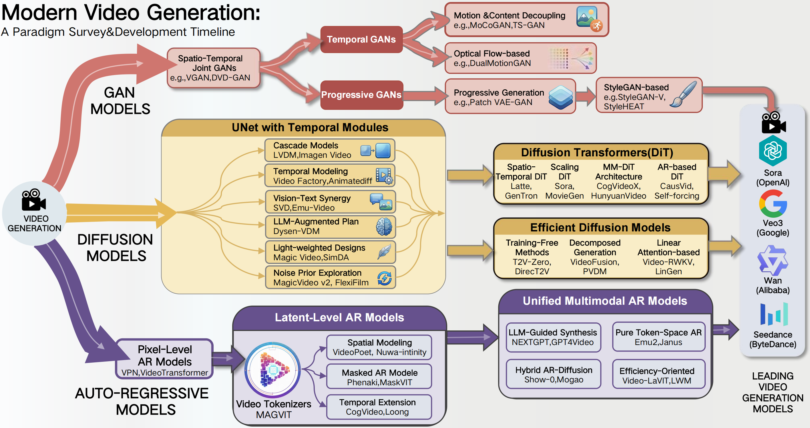
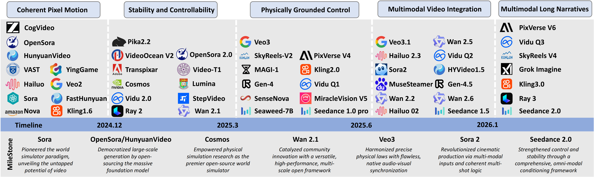
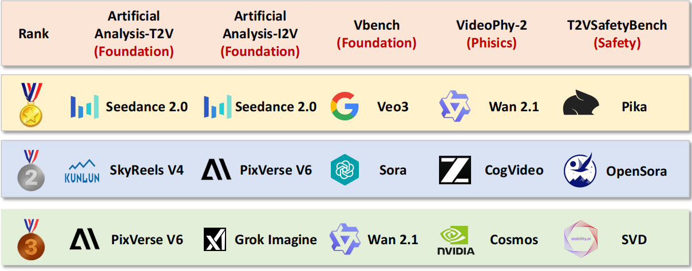
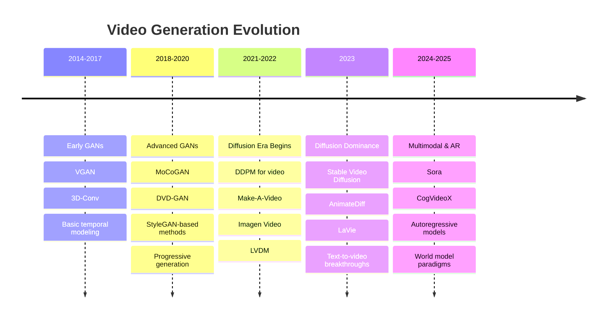

# Evolution of Video Generative Foundations

[](https://arxiv.org/)
[](https://github.com/sjtuplayer/Awesome-Video-Foundations)

[Teng Hu](#), [Jiangning Zhang](https://zhangzjn.github.io/), [Hongrui Huang](https://scholar.google.com/citations?user=x16uxsQAAAAJ&hl=en), [Ran Yi](https://yiranran.github.io/), [Zihan Su](https://github.com/Sugewud), [Jieyu Weng](#), [Zhucun Xue](#), [Lizhuang Ma](https://www.cs.sjtu.edu.cn/en/jiaoshiml/malizhuang.html), [Ming-Hsuan Yang](https://scholar.google.com/citations?user=p9-ohHsAAAAJ&hl=en), [Dacheng Tao](https://scholar.google.com/citations?user=RwlJNLcAAAAJ&hl=en)

---

## 📖 Overview

The rapid advancement of **Artificial Intelligence Generated Content (AIGC)** has revolutionized video generation, enabling systems — ranging from proprietary pioneers like **OpenAI's Sora**, **Google's Veo3**, and **ByteDance's Seedance** to powerful open-source contenders like **Wan** and **HunyuanVideo** — to synthesize temporally coherent and semantically rich videos. These advancements pave the way for building **"world models"** 🌍 that simulate real-world dynamics, with applications spanning entertainment, education, and virtual reality.

However, existing reviews on video generation often focus on narrow technical fields, e.g., GANs and diffusion models, or specific tasks (e.g., video editing), lacking a comprehensive perspective on the field's evolution, especially regarding **Auto-Regressive (AR) models** and integration of **multimodal information**.

To address these gaps, this survey provides a **systematic review** of the development of video generation technology, tracing its evolution through **three major paradigms**:

> 🎭 **GAN Era (2014-2020)** → 🌊 **Diffusion Dominance (2021-2025+)** → 🔄 **Autoregressive Future (2024-2025+)**

We conduct an **in-depth analysis** of the foundational principles, key advancements, and comparative strengths/limitations of each methodology. We then explore emerging trends in **multimodal video generation**, emphasizing the integration of diverse data types to enhance contextual awareness. Finally, by bridging historical developments and contemporary innovations, this survey offers insights to guide future research in video generation and its applications — including virtual/augmented reality, personalized education, autonomous driving simulations, digital entertainment, and advanced world models.

### 🎯 Key Contributions

**1️⃣ Comprehensive Coverage**: **Systematic review** of **three dominant paradigms** - 🎭 **GAN-based**, 🌊 **Diffusion-based**, and 🔄 **Autoregressive (AR)-based** methods
   - 📊 **50+ GAN models** spanning spatio-temporal joint modeling to StyleGAN-based generation
   - 🌊 **80+ Diffusion models** from UNet architectures to advanced Transformer-based approaches  
   - 🔄 **50+ AR models** covering pixel-level to latent space autoregressive generation

**2️⃣ Historical Perspective**: **Traces the complete evolution** from early GANs (2014) to current state-of-the-art models (2025)
   - 📈 **Decade-spanning analysis** of technological breakthroughs and paradigm shifts
   - 🔍 **Comparative assessment** of each era's strengths, limitations, and impact on the field

**3️⃣ Future Insights**: **Provides strategic guidance** for future research in video generation and **🌍 world modeling**
   - 🚀 **Emerging opportunities** in real-time generation and interactive content creation
   - ⚖️ **Safety and ethics** considerations for responsible AI development
   - 🔮 **Next-generation architectures** and scaling laws for video foundation models

---

## 🏗️ Architecture Overview

### 🗂️ **A Comprehensive Taxonomy of Video Generation Methodologies**

<div align="center">
  
</div>

> **📐 Taxonomy Overview**: This framework categorizes existing works based on three dominant generative paradigms — 🎭 **GANs**, 🌊 **Diffusion Models**, and 🔄 **Auto-Regressive Models** — and further structures them according to specific architectural designs and functional objectives. Key branches include:
> - 🎭 **GAN Models**: Spatio-Temporal Joint GANs → Temporal GANs (motion/content decoupling, optical flow) → Progressive GANs (StyleGAN-based)
> - 🌊 **Diffusion Models**: UNet with Temporal Modules → Diffusion Transformers (DiT) → Efficient Diffusion Models (training-free, decomposed, linear attention)
> - 🔄 **Auto-Regressive Models**: Pixel-Level → Latent-Level (video tokenizers, spatial/temporal modeling, masked AR) → Unified Multimodal AR Models

### 📅 **Leading Video Foundation Models Timeline (2024 - Present)**

<div align="center">
  
</div>

> **🚀 Recent Breakthroughs**: This timeline showcases the rapid evolution of video foundation models from December 2024 to the present, highlighting key milestones in:
> - 🎬 **Commercial Deployments**: Sora, Veo3, Runway Gen-3
> - 🔬 **Research Advances**: CogVideoX, HunyuanVideo, Wan
> - 📊 **Performance Leaps**: Resolution scaling, temporal consistency, generation speed
> - 🌐 **Multimodal Integration**: Text-to-video, image-to-video, audio-visual synthesis

### 📊 **Benchmark Evaluation Results for Leading Methods**

<div align="center">
  
</div>

> **📈 Comprehensive Assessment**: This evaluation matrix compares state-of-the-art video generation models across three key dimensions:
> - 🏗️ **Foundation**: Comprehensive video generation evaluation including visual quality, temporal consistency, text alignment, and generation efficiency
> - ⚖️ **Physics**: Physics-constrained evaluation covering motion realism, object dynamics, physical plausibility, and natural scene interactions
> - 🛡️ **Safety**: Generation safety evaluation including content appropriateness, bias detection, harmful content protection, and ethical compliance
>
> **Key Insights**: Diffusion models currently lead in quality, while autoregressive approaches show promise for scalability and controllability.

---


## 📚 Table of Contents

- [GAN-based Models](#-gan-based-models)
  - [Spatio-Temporal Joint GANs](#spatio-temporal-joint-gans)
  - [Temporal GANs](#temporal-gans)
    - [Motion and Content Decoupling](#motion-and-content-decoupling)
    - [Optical Flow-based Generation](#optical-flow-based-generation)
  - [Progressive GANs](#progressive-gans)
  - [StyleGAN-based Generation](#stylegan-based-generation)
- [Diffusion-based Models](#-diffusion-based-models)
  - [UNet with Temporal Modules](#1-unet-with-temporal-modules)
  - [Diffusion Transformers](#2-diffusion-transformers)
  - [Efficient Video Diffusion Models](#3-efficient-video-diffusion-models)
- [Autoregressive Models](#-autoregressive-models)
  - [Pixel-level AR Models](#pixel-level-ar-models)
  - [Latent Space AR Models](#latent-space-ar-models)
  - [Multimodal AR Models](#multimodal-ar-models)
- [Benchmarks & Evaluation](#-benchmarks--evaluation)
  - [Foundational Quality: Fidelity and Prompt Alignment](#foundational-quality-fidelity-and-prompt-alignment)
  - [Real-World Consistency: Physics, Commonsense, and Logic](#real-world-consistency-physics-commonsense-and-logic)
  - [Safety and Responsible AI](#safety-and-responsible-ai)
  - [Specific Capabilities: Motion, Temporality, and Narrative](#specific-capabilities-motion-temporality-and-narrative)
  - [Methodological Innovations for Scalable Evaluation](#methodological-innovations-for-scalable-evaluation)
- [Applications & Downstream Tasks](#-applications--downstream-tasks)
- [Research Trends & Future Directions](#-research-trends--future-directions)

---

## 🎭 GAN-based Models

> Generative Adversarial Networks (GANs) laid the groundwork for video synthesis, with innovations in spatio-temporal joint modeling, temporal decomposition, and progressive generation strategies.

### Spatio-Temporal Joint GANs
> Models that process both spatial and temporal dimensions simultaneously using unified architectures.

|     Model     | Paper                                                        |   Venue    |                           Website                            |                            GitHub                            |
| :-----------: | :----------------------------------------------------------- | :--------: | :----------------------------------------------------------: | :----------------------------------------------------------: |
|     `GAN`     | [](https://arxiv.org/abs/1406.2661)<br>Generative Adversarial Nets | NIPS 2014 |                              -                               | [](https://github.com/eriklindernoren/PyTorch-GAN) |
|   `3D-Conv`   | [](https://arxiv.org/abs/1412.0767)<br>Learning Spatiotemporal Features with 3D Convolutional Networks | ICCV 2015 |                              -                               | [](https://github.com/facebookarchive/C3D) |
|     `VGAN`    | [](https://arxiv.org/abs/1609.02612)<br>Generating Videos with Scene Dynamics | NIPS 2016 |                              -                               | [](https://github.com/GV1028/videogan) |
|   `DVD-GAN`   | [](https://arxiv.org/abs/1907.06571)<br>Adversarial Video Generation on Complex Datasets | arXiv 2019 |                              -                               | [](https://github.com/DataScienceNigeria/Efficient-Video-Generation-on-Complex-Datasets) |
|    `D-GAN`    | [](https://arxiv.org/abs/1907.08556)<br>Deep Generative Adversarial Nets for Spatio-Temporal Prediction | arXiv 2019 |                              -                               | [](https://github.com/stefan-jansen/synthetic-data-for-finance) |
|      `-`      | [](https://ieeexplore.ieee.org/abstract/document/9360626)<br>Spatiotemporal Generative Adversarial Network-Based Dynamic Texture Synthesis for Surveillance Video Coding | TMM 2021 |                              -                               |                              -                               |

### Temporal GANs
> Models that decompose video generation into motion and content components for more efficient training.

#### Motion and Content Decoupling
> Models that separate motion and content information in videos for more efficient generation and manipulation.

|     Model     | Paper                                                        |   Venue    |                           Website                            |                            GitHub                            |
| :-----------: | :----------------------------------------------------------- | :--------: | :----------------------------------------------------------: | :----------------------------------------------------------: |
|    `TGAN`     | [](https://arxiv.org/abs/1611.06624)<br>Temporal Generative Adversarial Nets With Singular Value Clipping | ICCV 2017 | [](https://pfnet-research.github.io/tgan/) | [](https://github.com/pfnet-research/tgan) |
|   `TGANs-C`  | [](https://arxiv.org/abs/1709.07421)<br>To Create What You Tell: Generating Videos from Captions | MM 2017 |                              -                               | [](https://github.com/yuxiaofelicia/generativevideorepo) |
|    `MCnet`    | [](https://arxiv.org/abs/1706.08033)<br>Decomposing Motion and Content for Natural Video Sequence Prediction | ICLR 2017 | [](https://sites.google.com/a/umich.edu/rubenevillegas/iclr2017) | [](https://github.com/rubenvillegas/iclr2017mcnet) |
|   `MoCoGAN`   | [](https://arxiv.org/abs/1707.04993)<br>MoCoGAN: Decomposing Motion and Content for Video Generation | CVPR 2018 |                              -                               | [](https://github.com/sergeytulyakov/mocogan) |
|    `SAVP`     | [](https://arxiv.org/abs/1804.01523)<br>Stochastic Adversarial Video Prediction | ICLR 2018 | [](https://alexlee-gk.github.io/video_prediction/) | [](https://github.com/alexlee-gk/video_prediction) |
|   `TS-GAN`    | [](https://arxiv.org/abs/2004.01823)<br>Time-series Generative Adversarial Networks | NIPS 2020 |                              -                               | [](https://github.com/jsyoon0823/TimeGAN) |
|   `TGANv2`   | [](https://arxiv.org/abs/1911.12453)<br>Train Sparsely, Generate Densely: Memory-Efficient Unsupervised Training of High-Resolution Temporal GAN | IJCV 2020 |                              -                               | [](https://github.com/pfnet-research/tgan2) |

#### Optical Flow-based Generation
> Models that analyze motion between consecutive video frames by estimating pixel flow for video generation or prediction.

|     Model     | Paper                                                        |   Venue    |                           Website                            |                            GitHub                            |
| :-----------: | :----------------------------------------------------------- | :--------: | :----------------------------------------------------------: | :----------------------------------------------------------: |
| `Dual Motion GAN` | [](https://arxiv.org/abs/1708.00284)<br>Dual Motion GAN for Future-Flow Embedded Video Prediction | ICCV 2017 |                              -                               | [](https://github.com/SaulZhang/Awesome_Video_Frame_Prediction) |
|    `FTGAN`    | [](https://arxiv.org/abs/2003.02410)<br>Hierarchical Video Generation From Orthogonal Information: Optical Flow and Texture | AAAI 2018 |                              -                               | [](https://github.com/mil-tokyo/FTGAN) |
|    `FW-GAN`   | [](https://arxiv.org/abs/1908.02231)<br>FW-GAN: Flow-navigated Warping GAN for Video Virtual Try-on | ICCV 2019 |                              -                               |                              -                               |

### Progressive GANs
> Models that generate content progressively, starting from low resolution and gradually increasing detail.

|     Model     | Paper                                                        |   Venue    |                           Website                            |                            GitHub                            |
| :-----------: | :----------------------------------------------------------- | :--------: | :----------------------------------------------------------: | :----------------------------------------------------------: |
| `PGGAN` | [](https://arxiv.org/abs/1710.10196)<br>Progressive Growing of GANs for Improved Quality, Stability, and Variation | ICLR 2018 |                              -                               | [](https://github.com/tkarras/progressive_growing_of_gans) |
|    `SWGAN`    | [](https://arxiv.org/abs/1706.02631)<br>Sliced Wasserstein Generative Models | ICLR 2018 |                              -                               | [](https://github.com/skolouri/swae) |
|      `-`      | [](https://arxiv.org/abs/1810.02419)<br>Towards High Resolution Video Generation with Progressive Growing of Sliced Wasserstein GANs | ICCV 2019 |                              -                               | [](https://github.com/musikisomorphie/swd) |
| `Patch VAE-GAN` | [](https://arxiv.org/abs/2006.12226)<br>Hierarchical Patch VAE-GAN: Generating Diverse Videos from a Single Sample | NIPS 2020 | [](https://shirgur.github.io/hp-vae-gan/) | [](https://github.com/shirgur/hp-vae-gan) |

### StyleGAN-based Generation
> Models leveraging StyleGAN's progressive architecture and style control for high-quality video generation.

|     Model     | Paper                                                        |   Venue    |                           Website                            |                            GitHub                            |
| :-----------: | :----------------------------------------------------------- | :--------: | :----------------------------------------------------------: | :----------------------------------------------------------: |
| `StyleVideoGAN` | [](https://arxiv.org/abs/2107.07224)<br>StyleVideoGAN: A Temporal Generative Model using a Pretrained StyleGAN | BMVC 2021 |                              -                               |                              -                               |
| `StyleGAN-V`  | [](https://arxiv.org/abs/2112.14683)<br>StyleGAN-V: A Continuous Video Generator with the Price, Image Quality and Perks of StyleGAN2 | CVPR 2021 | [](http://skor.sh/stylegan-v.html) | [](https://github.com/universome/stylegan-v) |
| `StyleHEAT`   | [](https://arxiv.org/abs/2203.04036)<br>StyleHEAT: One-Shot High-Resolution Editable Talking Face Generation via Pre-trained StyleGAN | ECCV 2022 | [](https://feiiyin.github.io/StyleHEAT/) | [](https://github.com/OpenTalker/StyleHEAT) |
| `StyleFaceV`  | [](https://arxiv.org/abs/2208.07862)<br>StyleFaceV: Face Video Generation via Decomposing and Recomposing Pretrained StyleGAN3 | arXiv 2022 |                              -                               |                              -                               |
|   `StyleSV`   | [](https://arxiv.org/abs/2212.07413)<br>Towards Smooth Video Composition | ICLR 2023 | [](https://genforce.github.io/StyleSV) | [](https://github.com/genforce/StyleSV) |

---

## 🌊 Diffusion-based Models

> Diffusion models have emerged as the dominant paradigm in video generation, offering superior quality and controllability through iterative denoising processes.

### 1. UNet with Temporal Modules
> Models leveraging UNet architectures with temporal modules for video generation.

|           Model            | Paper                                                        |   Venue    |                           Website                            |                            GitHub                            |
| :------------------------: | :----------------------------------------------------------- | :--------: | :----------------------------------------------------------: | :----------------------------------------------------------: |
|      ` Make-A-Video`       | [](https://arxiv.org/abs/2209.14792)<br>Make-A-Video: Text-to-Video Generation without Text-Video Data | arXiv 2022 | [](https://arxiv.org/abs/2209.14792) |                              -                               |
|       `Imagen Video`       | [](https://arxiv.org/abs/2210.02303)<br>Imagen Video: High Definition Video Generation with Diffusion Models | arXiv 2022 | [](https://imagen.research.google/video) |                              -                               |
|       `Magic Video`        | [](https://arxiv.org/abs/2211.11018)<br>MagicVideo: Efficient Video Generation With Latent Diffusion Models | arXiv 2022 |                              -                               |                              -                               |
|           `LVDM`           | [](https://arxiv.org/abs/2211.13221)<br>Latent Video Diffusion Models for High-Fidelity Long Video Generation | arXiv 2022 | [](https://yingqinghe.github.io/LVDM/) | [](https://github.com/YingqingHe/LVDM) |
|       `Latent-Shift`       | [](https://arxiv.org/abs/2304.08477)<br>Latent-Shift: Latent Diffusion with Temporal Shift for Efficient Text-to-Video Generation | arXiv 2023 | [](https://latent-shift.github.io) |                              -                               |
| `Align-Your-<br/>Latents ` | [](https://arxiv.org/abs/2304.08818)<br>Align your Latents: High-Resolution Video Synthesis with Latent Diffusion Models | CVPR 2023  | [](https://research.nvidia.com/labs/toronto-ai/VideoLDM/) |                              -                               |
|      `Video-Factory`       | [](https://arxiv.org/abs/2305.10874)<br>Swap Attention in Spatiotemporal Diffusions for Text-to-Video Generation | arXiv 2023 |                              -                               |                              -                               |
|          `PYOCO`           | [](https://arxiv.org/abs/2305.10474)<br>Preserve Your Own Correlation: A Noise Prior for Video Diffusion Models | ICCV 2023  | [](https://research.nvidia.com/labs/dir/pyoco/) |                              -                               |
|       `Animatediff`        | [](https://arxiv.org/abs/2307.04725)<br>AnimateDiff: Animate Your Personalized Text-to-Image Diffusion Models without Specific Tuning | ICLR 2024  | [](https://animatediff.github.io/) | [](https://github.com/guoyww/animatediff/) |
|      `ModelScopeT2V`       | [](https://arxiv.org/abs/2308.06571)<br>ModelScope Text-to-Video Technical Report | arXiv 2023 |                              -                               |                              -                               |
|          `SimDA`           | [](https://arxiv.org/abs/2308.09710)<br>SimDA: Simple Diffusion Adapter for Efficient Video Generation | CVPR 2024  | [](https://chenhsing.github.io/SimDA/) | [](https://github.com/ChenHsing/SimDA) |
|        `Dysen-VDM`         | [](https://arxiv.org/abs/2308.13812)<br>Dysen-VDM: Empowering Dynamics-aware Text-to-Video Diffusion with LLMs | CVPR 2024  | [](https://haofei.vip/Dysen-VDM/) | [](https://github.com/scofield7419/Dysen) |
|     `VideoDirectorGPT`     | [](https://arxiv.org/abs/2309.15091)<br>VideoDirectorGPT: Consistent Multi-Scene Video Generation via LLM-Guided Planning | COLM 2024  | [](https://videodirectorgpt.github.io) | [](https://github.com/HL-hanlin/VideoDirectorGPT) |
|          `LAVIE `          | [](https://arxiv.org/abs/2310.07771)<br>LaVie: High-Quality Video Generation with Cascaded Latent Diffusion Models | IJCV 2024  | [](https://vchitect.github.io/LaVie-project/) | [](https://github.com/Vchitect/LaVie) |
|      `DynamiCrafter`       | [](https://arxiv.org/abs/2310.12190)<br>DynamiCrafter: Animating Open-domain Images with Video Diffusion Priors | ECCV 2024  | [](https://doubiiu.github.io/projects/DynamiCrafter/) | [](https://github.com/Doubiiu/DynamiCrafter) |
|       `VideoCrafter`       | [](https://arxiv.org/abs/2310.19512)<br>VideoCrafter1: Open Diffusion Models for High-Quality Video Generation | arXiv 2023 | [](https://ailab-cvc.github.io/videocrafter2/) | [](https://github.com/AILab-CVC/VideoCrafter) |
|        `Emu-Video`         | [](https://arxiv.org/abs/2311.10709)<br>Emu Video: Factorizing Text-to-Video Generation by Explicit Image Conditioning | ECCV 2024  | [](https://luhannan.github.io/CogDrivingPage/) |                              -                               |
|        `PixelDance`        | [](https://arxiv.org/abs/2311.10982)<br>Make Pixels Dance: High-Dynamic Video Generation | CVPR 2024  | [](https://makepixelsdance.github.io) |                              -                               |
|           `SVD`            | [](https://arxiv.org/abs/2311.15127v1)<br>Stable Video Diffusion: Scaling Latent Video Diffusion Models to Large Datasets | arXiv 2023 | [](https://stability.ai/research/stable-video-diffusion-scaling-latent-video-diffusion-models-to-large-datasets) | [](https://github.com/Stability-AI/generative-models?tab=readme-ov-file) |
|       `MicroCinema`        | [](https://arxiv.org/abs/2311.18829)<br>MicroCinema: A Divide-and-Conquer Approach for Text-to-Video Generation | CVPR 2024  | [](https://wangyanhui666.github.io/MicroCinema.github.io/) |                              -                               |
|          `Show-1`          | [](https://arxiv.org/abs/2312.02934)<br>Show-1: Marrying Pixel and Latent Diffusion Models for Text-to-Video Generation |  IJCV2024  | [](https://showlab.github.io/Show-1/) | [](https://github.com/showlab/Show-1) |
|      `MagicVideo v2`       | [](https://arxiv.org/abs/2401.04468)<br>MagicVideo-V2: Multi-Stage High-Aesthetic Video Generation | arXiv 2024 | [](https://magicvideov2.github.io) |                              -                               |
|        `FlexiFilm`         | [](https://arxiv.org/abs/2404.18620)<br>FlexiFilm: Long Video Generation with Flexible Conditions | arxiv 2024 | [](https://y-ichen.github.io/FlexiFilm-Page/) | [](https://github.com/Y-ichen/FlexiFilm) |
|      `VideoCrafter2`       | [](https://arxiv.org/abs/2409.01595)<br>VideoCrafter2: Overcoming Data Limitations for High-Quality Video Diffusion Models | arXiv 2024 | [](https://ailab-cvc.github.io/videocrafter2/) | [](https://github.com/AILab-CVC/VideoCrafter) |


### 2. Diffusion Transformers
> Models using transformer-based architectures for video diffusion.

|      Model       | Paper                                                        |   Venue    |                           Website                            |                            GitHub                            |
| :--------------: | :----------------------------------------------------------- | :--------: | :----------------------------------------------------------: | :----------------------------------------------------------: |
|      `VDT`       | [](https://arxiv.org/abs/2305.13311)<br>VDT: General-purpose Video Diffusion Transformers via Mask Modeling | ICLR 2024  |                              -                               | [](https://github.com/RERV/VDT) |
|    `GenTron`     | [](https://arxiv.org/abs/2312.04557)<br>GenTron: Diffusion Transformers for Image and Video Generation | CVPR 2024  | [](https://www.shoufachen.com/gentron_website/) |                              -                               |
|    `W.A.L.T`     | [](https://arxiv.org/abs/2312.06662)<br>Photorealistic Video Generation with Diffusion Models | arXiv 2023 | [](https://walt-video-diffusion.github.io) |                              -                               |
|     `Latte`      | [](https://arxiv.org/abs/2401.03048)<br> Latte: Latent Diffusion Transformer for Video Generation | TMLR 2025  | [](https://maxin-cn.github.io/latte_project/) | [](https://github.com/Vchitect/Latte) |
|   `SnapVideo`    | [](https://arxiv.org/abs/2402.14797)<br>Snap Video: Scaled Spatiotemporal Transformers for Text-to-Video Synthesis | arXiv 2024 | [](https://snap-research.github.io/snapvideo/) |                              -                               |
|   `CogvideoX`    | [](https://arxiv.org/abs/2408.06072)<br>CogVideoX: Text-to-Video Diffusion Models with An Expert Transformer | ICLR 2025  | [](https://yzy-thu.github.io/CogVideoX-demo/) | [](https://github.com/zai-org/CogVideo) |
|  `PyramidFlow`   | [](https://arxiv.org/abs/2410.05954)<br>Pyramidal Flow Matching for Efficient Video Generative Modeling | ICLR 2025  | [](https://pyramid-flow.github.io/) | [](https://github.com/jy0205/Pyramid-Flow) |
|    `MovieGen`    | [](https://arxiv.org/abs/2410.13720)<br>Movie Gen: A Cast of Media Foundation Models | arXIv 2024 | [](https://ai.meta.com/research/movie-gen/) |                              -                               |
| `Open-Sora-Plan` | [](https://arxiv.org/abs/2412.00131)<br>Open-Sora Plan: Open-Source Large Video Generation Model | arXiv 2024 |                              -                               | [](https://github.com/PKU-YuanGroup/Open-Sora-Plan) |
| `Hunyuan Video`  | [](https://arxiv.org/abs/2412.03603)<br>HunyuanVideo: A Systematic Framework For Large Video Generation Model | arXiv 2025 | [](https://aivideo.hunyuan.tencent.com) | [](https://github.com/Tencent-Hunyuan/HunyuanVideo?tab=readme-ov-file) |
|   `LTX-Video`    | [](https://arxiv.org/abs/2501.00103)<br>LTX-Video: Realtime Video Latent Diffusion | arXiv 2025 | [](https://ltx.video) | [](https://github.com/Lightricks/LTX-Video) |
|      `Goku`      | [](https://arxiv.org/abs/2502.04896)<br>Goku: Flow Based Video Generative Foundation Models | CVPR 2025  | [](https://saiyan-world.github.io/goku/) | [](https://github.com/Saiyan-World/goku) |
|  `Lumina-Video`  | [](https://arxiv.org/abs/2502.06782)<br>Lumina-Video: Efficient and Flexible Video Generation with Multi-scale Next-DiT | arXiv 2025 |                              -                               | [](https://github.com/Alpha-VLLM/Lumina-Video) |
| `Step-Video T2V` | [](htttps://arxiv.org/abs/2502.10248)<br>Step-Video-T2V Technical Report: The Practice, Challenges, and Future of Video Foundation Model | arXiv 2025 | [](https://yuewen.cn/videos) | [](https://github.com/stepfun-ai/Step-Video-T2V) |
|    `FullDiT`     | [](https://arxiv.org/abs/2503.19907)<br>FullDiT: Multi-Task Video Generative Foundation Model with Full Attention | arXiv 2025 | [](https://fulldit.github.io) |                              -                               |
|      `Wan`       | [](https://arxiv.org/abs/2503.20314)<br>Wan: Open and Advanced Large-Scale Video Generative Models | arXiv 2025 | [](https://wan.video) | [](ttps://github.com/Wan-Video/Wan2.1) |


### 3. Efficient Video Diffusion Models
> Models optimized for efficiency in video generation through various acceleration and optimization techniques.

|     Model     | Paper                                                        |    Venue     |                           Website                            |                            GitHub                            |
| :-----------: | :----------------------------------------------------------- |:------------:| :----------------------------------------------------------: | :----------------------------------------------------------: |
|    `PVDM`     | [](https://arxiv.org/abs/2302.07685)<br>Video Probabilistic Diffusion Models in Projected Latent Space |  CVPR 2023   | [](https://sihyun.me/PVDM/) | [](https://github.com/sihyun-yu/PVDM) |
| `VideoFusion` | [](https://arxiv.org/abs/2303.08320)<br>VideoFusion: Decomposed Diffusion Models for High-Quality Video Generation |  CVPR 2023   |                              -                               |                              -                               |
|  `T2V-Zero`   | [](https://arxiv.org/abs/2303.13439)<br>Text2Video-Zero: Text-to-Image Diffusion Models are Zero-Shot Video Generators |  ICCV 2023   | [](https://text2video-zero.github.io) | [](https://github.com/Picsart-AI-Research/Text2Video-Zero) |
|  `DirectT2V`  | [](https://arxiv.org/abs/2305.14330)<br>DirecT2V: Large Language Models are Frame-Level Directors for Zero-Shot Text-to-Video Generation |  arXiv 2023  |                              -                               | [](https://github.com/cvlab-kaist/DirecT2V) |
|   `GD-VDM`    | [](https://arxiv.org/abs/2306.11173)<br>GD-VDM: Generated Depth for better Diffusion-based Video Generation |  arXiv 2023   |                              -                               | [](ttps://github.com/lapid92/GD-VDM/tree/main) |
|  `FreeBloom`  | [](https://arxiv.org/abs/2309.14494)<br>Free-Bloom: Zero-Shot Text-to-Video Generator with LLM Director and LDM Animator | NeurIPS 2023 |                              -                               | [](https://github.com/SooLab/Free-Bloom) |
|     `LVD`     | [](https://arxiv.org/abs/2309.17444)<br>LLM-grounded Video Diffusion Models |  ICLR 2024   | [](https://llm-grounded-video-diffusion.github.io) | [](https://github.com/TonyLianLong/LLM-groundedVideoDiffusion) |
|     `CMD`     | [](https://arxiv.org/abs/2403.14148)<br>Efficient Video Diffusion Models via Content-Frame Motion-Latent Decomposition |  ICLR 2024   | [](https://sihyun.me/CMD/) | [](https://github.com/NVlabs/CMD) |
|   `Matten`    | [](https://arxiv.org/abs/2405.03025)<br/>Matten: Video Generation with Mamba-Attention |  arXiv 2024  |                              -                               |                              -                               |
|     `DiM`     | [](https://arxiv.org/abs/2405.15881)<br>Scaling Diffusion Mamba with Bidirectional SSMs for Efficient Image and Video Generation |  arXiv 2024  |                              -                               |                              -                               |
| `Video-RWKV`  | [](https://arxiv.org/abs/2411.05636)<br>Video RWKV:Video Action Recognition Based RWKV |  arXiv 2024  |                              -                               |                              -                               |
|  `GridDiff`   | [](https://arxiv.org/abs/2412.03934)<br>Grid Diffusion Models for Text-to-Video Generation |  CVPR 2024   |                              -                               |                              -                               |
|   `LinGen`    | [](https://arxiv.org/abs/2412.09856)<br>LinGen: Towards High-Resolution Minute-Length Text-to-Video Generation with Linear Computational Complexity |  CVPR 2025   | [](https://lineargen.github.io) | [](https://github.com/jha-lab/LinGen) |

---

## 🔄 Autoregressive Models

> Autoregressive (AR) models represent the next frontier in video generation, leveraging next-token prediction frameworks for scalable and controllable video synthesis.

### Pixel-level AR Models
> Models that directly operate on raw pixel data using autoregressive prediction.

|     Model     | Paper                                                        |   Venue    |                           Website                            |                            GitHub                            |
| :-----------: | :----------------------------------------------------------- | :--------: | :----------------------------------------------------------: | :----------------------------------------------------------: |
| `VPN` | [](https://arxiv.org/abs/1610.00527)<br>Video Pixel Networks | ICML 2017 | - | - |
| `PMARD` | [](https://arxiv.org/abs/1703.03664)<br>Parallel Multiscale Autoregressive Density Estimation | ICML 2017 | - | - |
| `Video Transformer` | [](https://arxiv.org/abs/1906.02634)<br>Scaling Autoregressive Video Models | ICLR 2020 | - | - |

### Latent Space AR Models
> Models that perform autoregressive generation in compressed latent representations for improved efficiency.

|     Model     | Paper                                                        |   Venue    |                           Website                            |                            GitHub                            |
| :-----------: | :----------------------------------------------------------- | :--------: | :----------------------------------------------------------: | :----------------------------------------------------------: |
| `VideoGPT` | [](https://arxiv.org/abs/2104.10157)<br>VideoGPT: Video Generation using VQ-VAE and Transformers | arXiv 2021 | [](https://wilson1yan.github.io/videogpt/index.html) | [](https://github.com/wilson1yan/VideoGPT) |
| `TATS` | [](https://arxiv.org/abs/2204.03638)<br>Long Video Generation with Time-Agnostic VQGAN and Time Sensitive Transformer | ECCV 2022 | [](https://songweige.github.io/projects/tats) | [](https://github.com/SongweiGe/TATS) |
| `MAGVIT` | [](https://arxiv.org/abs/2212.05199)<br>MAGVIT: Masked Generative Video Transformer | CVPR 2023 | [](https://magvit.cs.cmu.edu/) | [](https://github.com/google-research/magvit) |
| `MAGVIT-v2` | [](https://arxiv.org/abs/2310.05737)<br>Language Model Beats Diffusion — Tokenizer Is Key to Visual Generation | ICLR 2024 | [](https://magvit.cs.cmu.edu/v2/) | - |
| `Open-MAGVIT2` | [](https://arxiv.org/abs/2409.04410)<br>Open-MAGVIT2: An Open-Source Project Toward Democratizing Auto-regressive Visual Generation | arXiv 2024 | - | [](https://github.com/TencentARC/SEED-Voken) |
| `VidTok` | [](https://arxiv.org/abs/2412.13061)<br>VidTok: A Versatile and Open-Source Video Tokenizer | arXiv 2024 | - | [](https://github.com/microsoft/VidTok) |
| `Omnitokenizer` | [](https://arxiv.org/abs/2406.09399)<br>Omnitokenizer: A Joint Image-Video Tokenizer for Visual Generation | NeurIPS 2024 | [](https://www.wangjunke.info/OmniTokenizer/) | [](https://github.com/FoundationVision/OmniTokenizer) |
| `Cosmos` | [](https://arxiv.org/abs/2501.03575)<br>Cosmos World Foundation Model Platform for Physical AI | arXiv 2025 | [](https://research.nvidia.com/labs/dir/cosmos-tokenizer/) | [](https://github.com/NVIDIA/Cosmos-Tokenizer?tab=readme-ov-file) |
| `LARP` | [](https://arxiv.org/abs/2410.21264)<br>Larp: Tokenizing Videos with a Learned Autoregressive Generative Prior | ICLR 2025 | [](https://hywang66.github.io/larp/) | [](https://github.com/hywang66/LARP/) |
| `LVT` | [](https://arxiv.org/)<br>Latent Video Transformer | arXiv 2020 | - | - |
| `GODIVA` | [](https://arxiv.org/)<br>GODIVA: Generating Open-DomaIn Videos from nAtural Descriptions | arXiv 2021 | - | - |
| `HARP` | [](https://arxiv.org/abs/2209.07143)<br>Harp: Autoregressive Latent Video Prediction with High-Fidelity Image Generator | ICIP 2022 | [](https://sites.google.com/view/harp-videos/home) | - |
| `Nuwa-infinity` | [](https://arxiv.org/abs/2207.09814)<br>Nuwa-infinity: Autoregressive over Autoregressive Generation for Infinite Visual Synthesis | NeurIPS 2022 | [](https://nuwa-infinity.microsoft.com/#/NUWAInfinity) | - |
| `CogVideo` | [](https://arxiv.org/abs/2205.15868)<br>CogVideo: Large-Scale Pretraining for Text-to-Video Generation via Transformers | arXiv 2022 | - | [](https://github.com/THUDM/CogVideo) |
| `Transframer` | [](https://arxiv.org/abs/2203.09494)<br>Transframer: Arbitrary Frame Prediction with Generative Models | TMLR 2023 | - | - |
| `IRIS` | [](https://arxiv.org/abs/2209.00588)<br>Transformers are Sample Efficient World Models | ICLR 2023 | - | [](https://github.com/eloialonso/iris) |
| `MOSO` | [](https://arxiv.org/abs/2303.03684)<br>MOSO: Decomposing MOtion, Scene and Object for Video Prediction | CVPR 2023 | [](https://iva-mzsun.github.io/MOSO) | [](https://github.com/iva-mzsun/MOSO) |
| `PAR` | [](https://arxiv.org/abs/2412.15119)<br>Parallelized Autoregressive Visual Generation | arXiv 2024 | [](https://epiphqny.github.io/PAR-project/) | [](https://github.com/Epiphqny/PAR) |
| `VideoPoet` | [](https://arxiv.org/abs/2312.14125)<br>VideoPoet: A Large Language Model for Zero-Shot Video Generation | ICML 2024 | [](https://sites.research.google/videopoet/) | - |
| `iVideoGPT` | [](https://arxiv.org/abs/2405.15223)<br>iVideoGPT: Interactive VideoGPTs are Scalable World Models | NeurIPS 2024 | [](https://thuml.github.io/iVideoGPT/) | [](https://github.com/thuml/iVideoGPT) |
| `LVM` | [](https://arxiv.org/abs/2312.00785)<br>Sequential Modeling Enables Scalable Learning for Large Vision Models | CVPR 2024 | [](https://yutongbai.com/lvm.html) | [](https://github.com/ytongbai/LVM) |
| `Loong` | [](https://arxiv.org/abs/2410.02757)<br>Loong: Generating Minute-level Long Videos with Autoregressive Language Models | arXiv 2024 | [](https://epiphqny.github.io/Loong-video/) | - |
| `ARCON` | [](https://arxiv.org/abs/2412.03758v1)<br>Advancing Auto-Regressive Continuation for Video Frames | arXiv 2024 | - | - |
| `Phenaki` | [](https://arxiv.org/abs/2210.02399)<br>Phenaki: Variable Length Video Generation From Open Domain Textual Description | ICLR 2023  | [](https://phenaki.video/) | - |
| `MaskViT` | [](https://arxiv.org/abs/2206.11894)<br>Masked visual pre-training for video prediction | arXiv 2022 | [](https://maskedvit.github.io/) | - |
| `WorldDreamer` | [](https://arxiv.org/abs/2401.09985)<br>WorldDreamer: Towards General World Models for Video Generation via Predicting Masked Tokens | arXiv 2024 | [](https://world-dreamer.github.io/) | [](https://github.com/PJLab-ADG/DriveArena) |
| `FACTOR` | [](https://arxiv.org/abs/2312.02919)<br>Fine-grained controllable video generation via object appearance and context | WACV 2025 | [](https://hhsinping.github.io/factor/) | - |
| `NOVA` | [](https://arxiv.org/abs/2412.14169)<br>AUTOREGRESSIVE VIDEO GENERATION WITHOUT VECTOR QUANTIZATION | ICLR 2025 | - | [](https://github.com/baaivision/NOVA) |

### Multimodal AR Models
> Models that integrate multiple modalities (text, audio, video) within unified autoregressive frameworks.

|     Model     | Paper                                                        |   Venue    |                           Website                            |                            GitHub                            |
| :-----------: | :----------------------------------------------------------- | :--------: | :----------------------------------------------------------: | :----------------------------------------------------------: |
| `UniVL` | [](https://arxiv.org/abs/2002.06353)<br>UniVL: A Unified Video and Language Pre-Training Model for Multimodal Understanding and Generation | arXiv | - | [](https://github.com/microsoft/UniVL) |
| `Nüwa` | [](https://arxiv.org/abs/2111.12417)<br>Nüwa: Visual synthesis pre-training for neural visual world creation | ECCV 2022  | [](https://nuwa-infinity.microsoft.com/#/) | - |
| `MMVID` | [](https://arxiv.org/abs/2203.02573)<br>Show Me What and Tell Me How: Video Synthesis via Multimodal Conditioning | CVPR 2022 | [](https://snap-research.github.io/MMVID/) | [](https://github.com/snap-research/MMVID) |
| `MMVG` | [](https://arxiv.org/abs/2211.12824)<br>Tell Me What Happened: Unifying Text-guided Video Completion via Multimodal Masked Video Generation | CVPR 2023 | - | - |
| `EMU` | [](http://arxiv.org/abs/2307.05222)<br>EMU: GENERATIVE PRETRAINING IN MULTIMODALITY | ICLR 2024 | - | [](https://github.com/baaivision/Emu) |
| `JAM` | [](http://arxiv.org/abs/2309.15564)<br>JOINTLY TRAINING LARGE AUTOREGRESSIVE MULTIMODAL MODELS | ICLR 2024 | - | [](https://github.com/kyegomez/MultiModalCrossAttn) |
| `NExT-GPT` | [](https://arxiv.org/abs/2309.05519)<br>NExT-GPT: Any-to-Any Multimodal LLM | ICML 2024 | [](https://next-gpt.github.io/) | [](https://github.com/NExT-GPT/NExT-GPT) |
| `GPT4Video` | [](https://arxiv.org/abs/2311.16511)<br>GPT4Video: A Unified Multimodal Large Language Model for Instruction-Followed Understanding and Safety-Aware Generation | MM 2024 | [](https://gpt4video.github.io/) | [](https://github.com/gpt4video/GPT4Video) |
| `CoDi-2` | [](https://arxiv.org/abs/2311.18775)<br>CoDi-2: In-Context, Interleaved, and Interactive Any-to-Any Generation | arXiv 2023 | [](https://codi-2.github.io/) | [](https://github.com/microsoft/i‑Code/tree/main/CoDi‑2) |
| `Emu2` | [](https://arxiv.org/abs/2312.13286)<br>Generative Multimodal Models are In-Context Learners | CVPR 2024 | [](https://baaivision.github.io/emu2/) | [](https://github.com/baaivision/Emu) |
| `Moonshot` | [](http://arxiv.org/abs/2401.01827)<br>Moonshot: Towards Controllable Video Generation and Editing with Multimodal Conditions | IJCV 2025 | [](https://showlab.github.io/Moonshot/) | - |
| `Video‑LaVIT` | [](https://arxiv.org/abs/2402.03161)<br>Video‑LaVIT: Unified Video‑Language Pre‑training with Decoupled Visual‑Motional Tokenization | ICML 2024 | [](https://video-lavit.github.io/) | [](https://github.com/jy0205/LaVIT) |
| `LWM` | [](http://arxiv.org/abs/2402.08268)<br>World Model on Million‑Length Video and Language with Blockwise RingAttention | ICLR 2025  | [](https://largeworldmodel.github.io/lwm/) | [](https://github.com/LargeWorldModel/LWM) |
| `X-VILA` | [](https://arxiv.org/pdf/2405.19335)<br>X-VILA: Cross-Modality Alignment for Large Language Model | arXiv 2024 | [](https://video-lavit.github.io/) | [](https://github.com/jy0205/LaVIT) |
| `SHOW‑O` | [](https://arxiv.org/abs/2408.12528)<br>SHOW‑O: ONE SINGLE TRANSFORMER TO UNIFY MULTIMODAL UNDERSTANDING AND GENERATION | ICLR 2025 | - | [](https://github.com/showlab/Show-o) |
| `VILA‑U` | [](https://arxiv.org/abs/2409.04429)<br>VILA‑U: A Unified Foundation Model Integrating Visual Understanding and Generation | ICLR 2025 | [](https://hanlab.mit.edu/projects/vila-u) | [](https://github.com/mit-han-lab/vila-u) |
| `MIO` | [](https://arxiv.org/abs/2409.17692)<br>MIO: A Foundation Model on Multimodal Tokens | arXiv 2024 | - | [](https://github.com/MIO-Team/MIO) |
| `Emu3` | [](http://arxiv.org/abs/2409.18869)<br>Emu3: Next-Token Prediction is All You Need | arXiv 2024 | [](https://emu.baai.ac.cn/about) | [](https://github.com/baaivision/Emu3) |
| `Janus` | [](https://arxiv.org/abs/2410.13848)<br>Janus: Decoupling Visual Encoding for Unified Multimodal Understanding and Generation | CVPR 2025 | - | [](https://github.com/deepseek-ai/Janus) |
| `Janusflow` | [](https://arxiv.org/abs/2411.07975)<br>Janusflow: Harmonizing autoregression and rectified flow for unified multimodal understanding and generation | CVPR 2025 | - | [](https://github.com/deepseek-ai/Janus) |
| `Tokenflow` | [](https://arxiv.org/abs/2412.03069)<br>Tokenflow: Unified image tokenizer for multimodal understanding and generation | CVPR 2025 | [](https://bytevisionlab.github.io/TokenFlow/) | [](https://github.com/ByteVisionLab/TokenFlow) |
| `GEM` | [](https://arxiv.org/abs/2412.11198)<br>A Generalizable Ego-Vision Multimodal World Model for Fine-Grained Ego-Motion, Object Dynamics, and Scene Composition Control | CVPR 2025 | [](https://vita-epfl.github.io/GEM.github.io/) | [](https://github.com/vita-epfl/GEM) |
| `MetaMorph` | [](http://arxiv.org/abs/2412.14164)<br>MetaMorph: Multimodal Understanding and Generation via Instruction Tuning | arXiv | [](https://tsb0601.github.io/metamorph/) | [](https://github.com/facebookresearch/metamorph/) |
| `Unitok` | [](http://arxiv.org/abs/2502.20321)<br>Unitok: A unified tokenizer for visual generation and understanding | arXiv | [](https://foundationvision.github.io/UniTok/) | [](https://github.com/FoundationVision/UniTok) |
| `WISE` | [](https://arxiv.org/abs/2503.07265)<br>WISE: A World Knowledge-Informed Semantic Evaluation for Text-to-Image Generation | arXiv | - | [](https://github.com/PKU-YuanGroup/WISE) |
| `MetaQueries` | [](https://arxiv.org/abs/2504.06256)<br>Transfer between Modalities with MetaQueries | arXiv | [](https://xichenpan.com/metaquery/) | [](https://github.com/facebookresearch/metaquery) |
| `Unitoken` | [](https://arxiv.org/abs/2504.04423)<br>Unitoken: Harmonizing multimodal understanding and generation through unified visual encoding | CVPRW 2025 | - | [](https://github.com/SxJyJay/UniToken) |
| `BAGEL` | [](http://arxiv.org/abs/2505.14683)<br>Emerging Properties in Unified Multimodal Pretraining | arXiv| - |-|
| `Mogao` | [](https://arxiv.org/abs/2505.05472)<br>Mogao: An Omni Foundation Model for Interleaved Multi-Modal Generation | arXiv | - | - |
| `BLIP3-o` | [](https://arxiv.org/abs/2505.09568)<br>BLIP3-o: A Family of Fully Open Unified Multimodal Models-Architecture, Training and Dataset | arXiv | [](https://jiuhaichen.github.io/BLIP3o-NEXT.github.io/) | [](https://github.com/JiuhaiChen/BLIP3o) |
| `Muddit` | [](https://arxiv.org/abs/2505.23606)<br>Muddit: Liberating Generation Beyond Text-to-Image with a Unified Discrete Diffusion Model | arXiv | - | [](https://github.com/M-E-AGI-Lab/Muddit) |
| `UniWorld` | [](https://arxiv.org/abs/2506.03147)<br>UniWorld: High-Resolution Semantic Encoders for Unified Visual Understanding and Generation | arXiv | - | [](https://github.com/PKU-YuanGroup/UniWorld-V1) |
| `Show-o2` | [](https://arxiv.org/abs/2506.15564)<br>Show-o2: Improved Native Unified Multimodal Models | NeurIPS 2025 | - | [](https://github.com/showlab/Show-o) |
| `Qwen-Image` | [](https://arxiv.org/abs/2508.02324)<br>Qwen-Image Technical Report | arXiv | - | [](https://github.com/QwenLM/Qwen-Image) |
| `RecA` | [](https://www.arxiv.org/abs/2509.07295)<br>Reconstruction Alignment Improves Unified Multimodal Models | arXiv | [](https://reconstruction-alignment.github.io/) | [](https://github.com/HorizonWind2004/reconstruction-alignment) |

---

## 📊 Benchmarks & Evaluation

> Comprehensive evaluation frameworks for assessing video generation quality, temporal consistency, and semantic alignment.

### Foundational Quality: Fidelity and Prompt Alignment
> Benchmarks focusing on core video generation capabilities: visual quality, temporal consistency, and prompt adherence.

|   Benchmark   | Paper                                                        |   Venue    |                           Website                            |                            GitHub                            |
| :-----------: | :----------------------------------------------------------- | :--------: | :----------------------------------------------------------: | :----------------------------------------------------------: |
|   `VBench`    | [](https://arxiv.org/abs/2311.17982)<br>VBench: Comprehensive Benchmark Suite for Video Generative Models | CVPR 2024 | [](https://vchitect.github.io/VBench-project/) | [](https://github.com/Vchitect/VBench) |
| `T2V-CompBench` | [](https://arxiv.org/abs/2407.14505)<br>T2V-CompBench: A Comprehensive Benchmark for Compositional Text-to-video Generation | CVPR 2025 | [](https://t2v-compbench.github.io/) | [](https://github.com/KaiyueSun98/T2V-CompBench) |

### Real-World Consistency: Physics, Commonsense, and Logic
> Benchmarks evaluating whether generated videos conform to real-world physical laws, commonsense reasoning, and logical consistency.

|   Benchmark   | Paper                                                        |   Venue    |                           Website                            |                            GitHub                            |
| :-----------: | :----------------------------------------------------------- | :--------: | :----------------------------------------------------------: | :----------------------------------------------------------: |
| `VBench-2.0`  | [](https://arxiv.org/abs/2503.21755)<br>VBench-2.0: Advancing Video Generation Benchmark Suite for Intrinsic Faithfulness | arXiv 2025 | [](https://vchitect.github.io/VBench-project/) | [](https://github.com/Vchitect/VBench) |
| `VideoGen-Eval` | [](https://arxiv.org/abs/2503.23452)<br>VideoGen-Eval: Agent-based System for Video Generation Evaluation | arXiv 2025 | [](https://ailab-cvc.github.io/VideoGen-Eval/) | [](https://github.com/AILab-CVC/VideoGen-Eval) |
| `Physics-IQ`  | [](https://arxiv.org/abs/2501.09038)<br>Do Generative Video Models Understand Physical Principles? | arXiv 2025 |                              -                               |                              -                               |
| `VideoPhy-2`  | [](https://arxiv.org/abs/2503.06800)<br>VideoPhy-2: A Challenging Action-Centric Physical Commonsense Evaluation in Video Generation | ICLR 2026 | [](https://videophy2.github.io/) | [](https://github.com/Hritikbansal/videophy) |

### Safety and Responsible AI
> Benchmarks evaluating the safety of generated content, including harmful content detection, bias, and ethical compliance.

|   Benchmark   | Paper                                                        |   Venue    |                           Website                            |                            GitHub                            |
| :-----------: | :----------------------------------------------------------- | :--------: | :----------------------------------------------------------: | :----------------------------------------------------------: |
| `T2VSafetyBench` | [](https://arxiv.org/abs/2407.05965)<br>T2VSafetyBench: Evaluating the Safety of Text-to-Video Generative Models | NeurIPS 2024 |                              -                               | [](https://github.com/yibo-miao/T2VSafetyBench) |
| `VBench++`    | [](https://arxiv.org/abs/2411.13503)<br>VBench++: Comprehensive and Versatile Benchmark Suite for Video Generative Models | arXiv 2024 | [](https://vchitect.github.io/VBench-project/) | [](https://github.com/Vchitect/VBench) |

### Specific Capabilities: Motion, Temporality, and Narrative
> Benchmarks focusing on specialized video aspects such as motion dynamics, long-range temporal reasoning, and storytelling.

|   Benchmark   | Paper                                                        |   Venue    |                           Website                            |                            GitHub                            |
| :-----------: | :----------------------------------------------------------- | :--------: | :----------------------------------------------------------: | :----------------------------------------------------------: |
|   `VMBench`   | [](https://arxiv.org/abs/2503.10076)<br>VMBench: A Benchmark for Perception-Aligned Video Motion Generation | ICCV 2025 | [](https://amap-ml.github.io/VMBench-Website/) | [](https://github.com/GD-AIGC/VMBench) |
| `ChronoMagic-Bench` | [](https://arxiv.org/abs/2406.18522)<br>ChronoMagic-Bench: A Benchmark for Metamorphic Evaluation of Text-to-Time-lapse Video Generation | NeurIPS 2024 | [](https://pku-yuangroup.github.io/ChronoMagic-Bench/) | [](https://github.com/PKU-YuanGroup/ChronoMagic-Bench) |
| `MovieBench`  | [](https://arxiv.org/abs/2411.15262)<br>MovieBench: A Hierarchical Movie Level Dataset for Long Video Generation | CVPR 2025 | [](https://weijiawu.github.io/MovieBench/) | [](https://github.com/showlab/MovieBench) |

### Methodological Innovations for Scalable Evaluation
> Innovations in the evaluation process itself, including human preference ranking and automated LLM-based assessment.

|   Benchmark   | Paper                                                        |   Venue    |                           Website                            |                            GitHub                            |
| :-----------: | :----------------------------------------------------------- | :--------: | :----------------------------------------------------------: | :----------------------------------------------------------: |
| `K-Sort Arena` | [](https://arxiv.org/abs/2408.14468)<br>K-Sort Arena: Efficient and Reliable Benchmarking for Generative Models via K-wise Human Preferences | CVPR 2025 |                              -                               |                              -                               |
| `AIGV-Assessor` | [](https://arxiv.org/abs/2411.17221)<br>AIGV-Assessor: Benchmarking and Evaluating the Perceptual Quality of Text-to-Video Generation with LMM | CVPR 2025 |                              -                               | [](https://github.com/wangjiarui153/AIGV-Assessor) |
| `Video-Bench` | [](https://arxiv.org/abs/2311.16103)<br>Video-Bench: A Comprehensive Benchmark and Toolkit for Evaluating Video-based Large Language Models | arXiv 2023 |                              -                               | [](https://github.com/PKU-YuanGroup/Video-Bench) |

---

## 🎯 Applications & Downstream Tasks

> Real-world applications and specialized tasks enabled by video generation models.

### Content Creation & Entertainment
- **Film & Animation**: Automated scene generation, character animation, visual effects
- **Gaming**: Procedural content generation, dynamic environments, NPC behavior
- **Social Media**: Short-form video creation, content augmentation, viral content generation

### Education & Training
- **Educational Content**: Interactive learning materials, historical recreations, scientific visualizations
- **Professional Training**: Simulation-based training, safety scenarios, skill development
- **Language Learning**: Immersive language environments, cultural context videos

### Scientific & Industrial Applications
- **Autonomous Driving**: Simulation environments, edge case generation, safety testing
- **Robotics**: Behavior prediction, environment simulation, training data generation
- **Medical**: Surgical training, patient education, therapy applications
- **Climate & Weather**: Environmental modeling, disaster simulation, climate visualization

### Virtual & Augmented Reality
- **Metaverse**: Virtual world creation, avatar animation, social interactions
- **AR Applications**: Real-time content overlay, interactive experiences, spatial computing
- **Digital Twins**: Industrial simulation, urban planning, architectural visualization

---

## 📈 Timeline & Evolution



---


## 🔬 Research Trends & Future Directions

### 🚧 Current Challenges
- **⏱️ Temporal Consistency**: Maintaining coherent motion and object persistence across frames
- **⚡ Computational Efficiency**: Reducing inference time and memory requirements
- **🎛️ Controllability**: Fine-grained control over generation process and content
- **📹 Long-form Generation**: Scaling to minute-length or longer videos
- **🔗 Multimodal Integration**: Seamless fusion of text, audio, and visual modalities

### 📈 Emerging Trends
- **🌍 World Models**: Building comprehensive environmental representations
- **🔄 Autoregressive Scaling**: Leveraging LLM-style scaling laws for video
- **⚡ Real-time Generation**: Achieving interactive generation speeds
- **👤 Personalization**: User-specific content generation and style adaptation
- **🛡️ Safety & Ethics**: Ensuring responsible AI development and deployment

### 🔮 Future Opportunities
- **🎮 Interactive Video Generation**: Real-time user interaction and modification
- **🧠 Cross-modal Understanding**: Deep integration of vision, language, and audio
- **🔗 Causal Reasoning**: Understanding and modeling cause-effect relationships
- **⚖️ Physical Simulation**: Accurate physics-based video generation
- **🤝 Collaborative Creation**: Human-AI collaborative content creation workflows

---

## 🤝 Contributing

We welcome contributions to this survey! Please feel free to:

- **Add new papers**: Submit PRs with new video generation models
- **Update information**: Correct errors or add missing details
- **Suggest improvements**: Propose better categorization or organization
- **Report issues**: Flag broken links or outdated information

### Contribution Guidelines
1. Follow the existing format for consistency
2. Include paper title, authors, venue, and links
3. Provide brief, accurate descriptions
4. Ensure all links are functional
5. Maintain chronological order within categories

---

## 📚 Citation

If you find this survey useful for your research, please consider citing:

```bibtex
@article{hu2025video,
  title={Evolution of Video Generative Foundations},
  author={Hu, Teng and Zhang, Jiangning and Huang, Hongrui and Yi, Ran and Su, Zihan and Weng, Jieyu and Xue, Zhucun and Ma, Lizhuang and Yang, Ming-Hsuan and Tao, Dacheng},
  journal={arXiv},
  year={2025}
}
```

---


## 🔗 Resources & Links

### Related Surveys & Resources
- [Awesome Diffusion Models](https://github.com/heejkoo/Awesome-Diffusion-Models)
- [Awesome Video Generation](https://github.com/yzhang2016/video-generation-survey)
- [Awesome Multimodal ML](https://github.com/pliang279/awesome-multimodal-ml)
- [Papers With Code - Video Generation](https://paperswithcode.com/task/video-generation)

---

## 📜 License

This project is licensed under the MIT License - see the [LICENSE](LICENSE) file for details.

---

## 🙏 Acknowledgments

We thank the video generation research community for their groundbreaking work and the open-source contributors who make this field accessible to everyone. Special thanks to all the authors whose papers are included in this survey.

---

<div align="center">
  
  
  
</div>

<div align="center">
  <strong>⭐ Star this repository if you find it helpful! ⭐</strong>
</div>